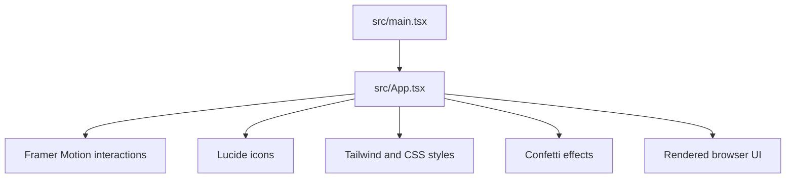

# ea-nasir

`ea-nasir` is a React/Vite interface experiment with animated interactions and a Tailwind-based visual system. The app is written in TypeScript and uses Framer Motion, Lucide icons, and canvas-confetti for interaction polish.

## Run locally

```bash
npm install
npm run dev
```

Open the local URL printed by Vite. Create a production build with:

```bash
npm run build
npm run preview
```

## Checks

```bash
npm run lint
```

The main UI entry point is `src/App.tsx`; global and component styles live in `src/` alongside it. `dist/` is generated output and should not be edited by hand.

## UI architecture


